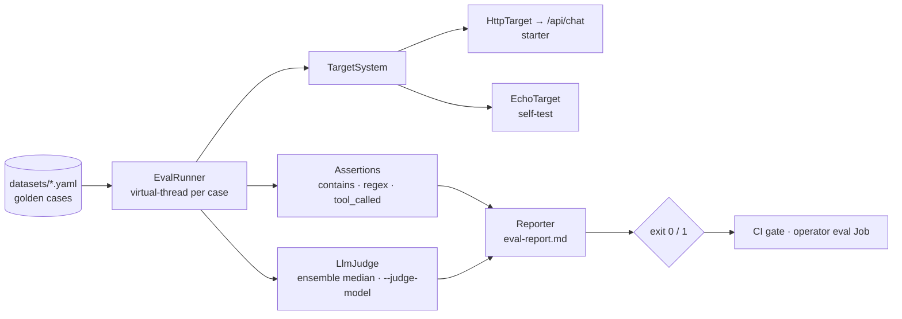

# agent-evals

[](https://github.com/hhagenbuch/agent-evals/actions)


**JUnit for LLM agents.** Golden datasets in YAML, deterministic assertions,
LLM-as-judge for the fuzzy parts, and an exit code you can gate CI on.

Agents regress silently: a prompt tweak fixes one behavior and breaks three
others. The fix is the same as it's always been in software — a regression
suite that runs on every change. This is that suite, in plain Java with no
framework to adopt.

## Architecture



## How it works

```yaml
# datasets/customer-support.yaml
name: customer-support
target: http://localhost:8080/api/chat
cases:
  - id: grounded-math
    prompt: "What is 973 * 481? Use your calculator tool."
    assert:
      - type: contains          # deterministic — always enforced
        value: "468013"
      - type: judge             # fuzzy — scored 1-5 by an LLM
        criteria: "States the correct product clearly and concisely."
        min_score: 4
```

```bash
mvn -q package
java -jar target/agent-evals-0.1.0-SNAPSHOT.jar datasets/customer-support.yaml
# [PASS] grounded-math (2140 ms)
# customer-support: 3/3 cases passed (min-pass-rate 1.00) — report: eval-report.md
# exit code 0 → CI proceeds; any failure → exit 1 → CI blocks the merge
```

By default every case must pass. For flaky-tolerant gates, lower the bar with
`--min-pass-rate` (exit 0 iff `passed/total ≥ threshold`):

```bash
java -jar target/agent-evals-0.1.0-SNAPSHOT.jar datasets/customer-support.yaml --min-pass-rate 0.9
```

Some cases must never be traded against the average. Mark them
`required: true` in the dataset (or force at runtime with `--require id1,id2`)
and the gate fails if they fail, **regardless of the aggregate** — the home of
regression cases exported from production incidents. A `--require` id absent
from the dataset also fails the gate (fail-closed, not a free pass).

Every run also emits the gate decision machine-readably: a `verdict.json`
(`--verdict FILE`) next to the markdown report, and the same document as a
final `VERDICT-JSON: {...}` stdout line — so a consumer that only sees a
container log (say, a Kubernetes Job's) still gets per-case pass/fail,
required flags, rates, and `gatePassed` without any shared volume.

Judge assertions ensemble the model 3× by default (median score). Cut that to a
single call — a third of the judge tokens — with `--judge-ensemble 1`:

```bash
java -jar target/agent-evals-0.1.0-SNAPSHOT.jar datasets/customer-support.yaml --judge-ensemble 1
```

Parallel cases × concurrent ensemble can burst a lot of judge calls at once. The
judge already retries 429/5xx with backoff; if you still hit rate limits, cap how
many cases run at once with `--concurrency N`:

```bash
java -jar target/agent-evals-0.1.0-SNAPSHOT.jar datasets/customer-support.yaml --concurrency 4
```

## Design

- **Two assertion tiers.** `contains` / `not_contains` / `regex` are
  deterministic and always run. `judge` calls a model with explicit criteria
  and a score threshold — and is **skipped, not failed**, when no
  `ANTHROPIC_API_KEY` is present, so the deterministic tier still gates
  keyless CI runs (see `eval-gate.yml`).
- **Trajectory, not just output.** `tool_called` (value: a tool name) asserts
  the agent *actually invoked the right tool*, not merely that it said the right
  thing. It reads the `toolsUsed` trace the target reports (the
  [starter](https://github.com/hhagenbuch/spring-ai-agent-starter) returns it on
  every `/api/chat` response); a target that reports no trace fails the
  assertion rather than passing silently.
- **Targets are pluggable.** `HttpTarget` speaks the chat-endpoint shape of
  [spring-ai-agent-starter](https://github.com/hhagenbuch/spring-ai-agent-starter);
  `EchoTarget` lets the harness test itself. Implement `TargetSystem` (one
  method) for anything else.
- **Cases run in parallel.** Each case is dispatched on its own virtual thread
  (`Executors.newVirtualThreadPerTaskExecutor()`), so a suite that is mostly
  waiting on the target or judge finishes in about the time of its slowest case.
  Results are still reported in dataset order, so the report and exit code are
  deterministic.
- **Judge ensembling.** Each `judge` assertion polls the model `--judge-ensemble`
  times (**default 3**) and takes the **median** score, damping the variance of
  any single stochastic grade before it can flip a CI gate. The polls run
  concurrently, so ensembling costs latency of *one* call, not three — but it
  does cost 3× the **tokens**. Set `--judge-ensemble 1` to disable it (single
  call, a third of the judge spend) where cost matters more than stability. The
  judge retries 429/5xx with exponential backoff (parallel cases burst its
  request rate), and `--concurrency N` caps concurrent cases if you still throttle.
- **Reports are artifacts.** Every run writes `eval-report.md` with per-case
  results, timings, and judge rationales — uploaded by CI on pass *and* fail,
  because the failing report is the useful one.

## Container image

Published to GHCR on every push to `main`:

```bash
docker run --rm -v "$PWD/datasets":/data \
  ghcr.io/hhagenbuch/agent-evals:0.1.0 /data/smoke.yaml --min-pass-rate 0.9
```

The image's entrypoint *is* the runner, so container args are the CLI args. This
is what [agent-operator](https://github.com/hhagenbuch/agent-operator) runs as
its in-cluster eval-gate Job.

## Roadmap

- [x] YAML datasets, deterministic + judge assertions, markdown reports, CI gate
- [x] Pass-rate threshold flag (`--min-pass-rate 0.9`) for flaky-tolerant gates
- [x] Parallel case execution (virtual threads)
- [x] Trajectory assertions (did the agent call the *right tools*, not just answer well)
- [x] Judge ensembling to reduce single-judge variance (concurrent, `--judge-ensemble N`, `--judge-model MODEL`)
- [x] Judge retry/backoff on 429/5xx + `--concurrency N` case cap for rate limits

## License

MIT
